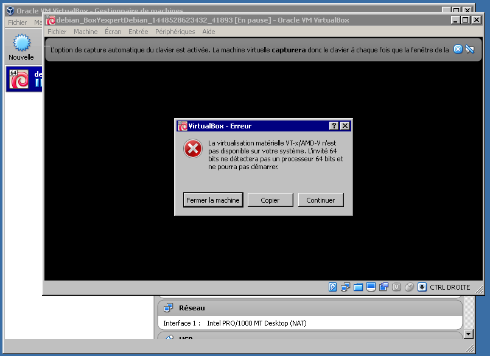
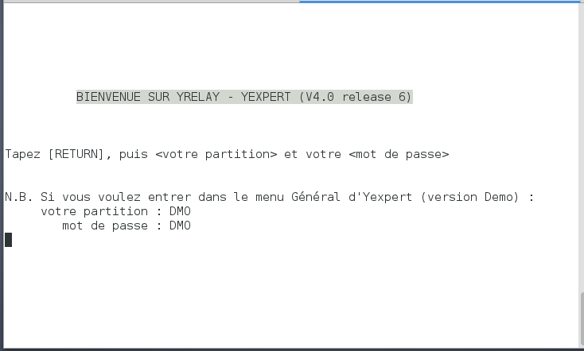

# VM de votre système expert...

Cette arborescence fournit les outils que vous aurez besoin pour créer une VM Vagrant de votre système expert. Elle est maintenue par Yrelay et diffusée sous licence libre. Cette version comprend des contributions communautaires libres acceptées par Yrelay.

Disclaimer : Yexpert est encore en développement et son interface peut changer dans les futures versions. Utilisez la production à vos propres risques.

Remarque : Si vous êtes sur un système Linux type Debian, et que vous souhaitez installer **Yexpert** en local, allez au paragraphe [15. Installer Yexpert en local](https://github.com/Yrelay/Yexpert-Box#15-installer-yexpert-en-local).

## 1. Qu'est-ce que Vagrant

[Vagrant](http://www.vagrantup.com) est une application libre qui permet la mise en place d'environnements de développement faciles. Il est constitué essentiellement d'une machine virtuelle automatisée (VM) qui peut dialoguer avec de nombreuses solutions (VirtualBox, Rackspace, AWS, etc.) pour créer une VM de base et y déployer une application comme Yexpert.

Pour connaitre l'histoire de Vagrant suivre de ce [lien](http://www.vagrantup.com/about.html).

## 2. Tutoriel vidéo

Il y a un didacticiel vidéo qui illustre cette procédure dans un environnement Linux sur [YouTube](https://www.youtube.com/watch?v=YpkPAb7q10k). Ceci est hautement recommandé pour les nouveaux utilisateurs à Vagrant.

## 3. Pourquoi Vagrant ?

Vagrant remplit les conditions suivantes :
* Open Source
* Compatible avec de multiples fournisseurs VM, y compris les fournisseurs de cloud
* Ecriture facile de scripts d'automatisation
* Utilisation facile pour les utilisateurs finaux

## 4. Comment puis-je utiliser Vagrant ?

Vous devez d'abord télécharger et installer quelques utilitaires :

### 4.1. Vagrant

Si vous êtes sur un système Linux type Debian, vous pouvez taper :

	~$ sudo apt-get update && sudo apt-get upgrade -y
	~$ sudo apt-get install vagrant

Sinon, Vagrant peut être téléchargé à partir http://downloads.vagrantup.com/. Vous devez télécharger la version correcte de Vagrant en fonction de votre système d'exploitation.

Yrelay a testé Vagrant 1.6.5, mais il n'y a aucune raison que les nouvelles versions ne fonctionnent pas.

### 4.2. VirtualBox

VirtualBox est un logiciel de virtualisation open source qui fonctionne avec Vagrant. Si vous êtes sur un système Linux type Debian, vous pouvez taper :

	~$ sudo apt-get install virtualbox

Sinon, VirtualBox peut être téléchargé à partir https://www.virtualbox.org/wiki/Downloads. L'installation est simple et vous pouvez prendre les valeurs par défaut durant le processus d'installation.

### 4.3. Git

Pour télécharger le référentiel Git **https://github.com/Yrelay/Yexpert-box** vous avez besoin de Git. Ce logiciel est un système de contrôle de version source distribué et ouvert qui est incroyablement pratique et populaire pour la gestion du code source de projets. Si vous êtes sur un système Linux type Debian, vous pouvez taper :

	~$ sudo apt-get install git

Sinon, Git est disponible à l'adresse http://www.git-scm.com. L'installation est simple et vous pouvez prendre les valeurs par défaut durant le processus d'installation.

## 5. Cloner le dépôt Yexpert-Box

Le référentiel **Yexpert-Box** contient tous les fichiers spécifiques du projet pour dire à Vagrant quoi faire et comment le faire. Nous allons commencer par l'ouverture d'une invite **git-bash** (sous Windows) ou un **shell bash** (sous Linux).

Remarque : Les guides supposent que vous allez utiliser un **git-bash** ou un **shell bash** pour toutes les futures interactions avec Vagrant. Vous pouvez cloner le dépôt **Yexpert-Box** n'impote où, mais pour plus de simplicité, nous allons cloner dans un nouveau répertoire **Yrelay** :

	~$ cd ~
	~$ mkdir Yrelay
	~$ cd Yrelay
	~/Yrelay$ git clone https://github.com/Yrelay/Yexpert-Box.git

Cela ne devrait prendre que quelques minutes être téléchargé.

## 6. Installer un plugin additionnel pour Vagrant VirtualBox 

Avec les dernières versions de VirtualBox et Vagrant le montage des dossiers partagés peut échouer. En ajoutant un plugin additionnel pour Vagrant, VirtualBox sera automatiquement installé quand une VM est montée.

Pour installer le plugin procéder comme suit :

	~$ cd ~
	~$ vagrant plugin install vagrant-vbguest

Vous pouvez voir une erreur durant l'install **"Could not find the X.Org or XFree86 Window System, skipping."**. Cette erreur ne posera pas de problèmes. Cela vient du fait que la VM créée ne contient pas d'interface graphique.

## 7. Démarrer le process

Maintenant, puisque nous avons un clone du référentiel **Yexpert-Box**, nous devons créer une nouvelle machine virtuelle utilisant Vagrant. Ce processus est automatisé et devrait prendre environ 20 minutes.

Remarque : Si vous ne souhaitez pas installer les répertoires de développement par défaut (nécessaire pour la ré-exécuter des tests), vous devez modifier manuellement le **Vagrantfile** situé dans **~/Yrelay/Yexpert-Box/debian** et enlever le **-e** sur la ligne 155. Il devrait ressembler à : **s.args = "-i " + "#{ENV['instance']}"**

Les scripts pour la VM sont situés dans **~/Yrelay/Yexpert-Box/** et le fichier **Vagrantfile** est située dans **~/Yrelay/Yexpert-Box/debian**.

	~$ cd ~/Yrelay/Yexpert-Box/debian
	~/Yrelay/Yexpert-Box/debian$ vagrant up

Le processus est très verbeux avec du texte vert et rouge. Pour les utilisateurs avancés, le texte vert serait du texte standard et le rouge correspond à des informations complémentaires. Un texte rouge ne signifie pas qu'il y a une erreur. Vagrant affichera un message d'erreur s'il y a vraiment une erreur. Si vous rencontrez des difficultés, vous pouvez envoyer un message au projet Yexpert d'Yrelay http://www.yrelay.fr. Dans ce cas, une sortie écran peut aider à comprendre le problème.

Sur mon système, j’initialise les variables LANG et **LC_MESSAGES** à, respectivement, **fr_FR.utf8** et **en_US.utf8**. Ainsi, les différents programmes appliquent les paramètres régionaux français à l’exception des messages qui sont affichés en anglais. Cela implique de bien inclure ces deux « locales » dans le fichier /etc/locale.gen. Toutefois, celles-ci peuvent être indisponibles sur certains systèmes distants. La plupart des applications se rabattent sur la locale C sans broncher. Une exception notable est Perl qui se plaint très bruyamment. La documentation de Perl explique comment se débarasser de ce message.

	export PERL_BADLANG=0

Remarque : Vous pouvez recontrez des problèmes avec la création des définitions des paramètres régionaux et le positionnement de LANG. Pour corriger le problème, suivre les deux étapes en lancant la commande suivante :

	sudo dpkg-reconfigure locales

Cochez au moins le paramètre correspondant à votre langue (fr) et votre pays (FR, BE, LU, etc), avec ou sans l'euro. Par exemple : fr_FR.UTF-8

Sur certaine machine vous devrez activer le support vt-x/amd-v dans le BIOS, sans lequel vous ne pourrez pas utiliser la virtualisation.

## 8. Accès Yexpert-Box

La VM met en place protocole SSH, et ouvre les ports suivants sur VirtualBox.

* 22 - SSH pour le cloud ou en local
* 2222 - SSH pour la VirtualBox

Remarque : Si vous utilisez un fournisseur de cloud (AWS/EC2, Rackspace) vous devrez ouvrir le pare-feu du cloud pour les ports suivants avant de commencer le processus.

Les codes d'Accès/Vérification sont les mêmes utilisés dans les tests automatisés d'Yrelay.

Remarque : Si vous utilisez un fournisseur de cloud (Rackspace, AWS) le moyen le plus facile de connaitre l'adresse IP est de rechercher votre adresse DNS dans le portail de gestion de votre fournisseur de cloud.

Vous pouvez également accéder à la machine virtuelle en utilisant un autre programme SSH (ex: PuTTY), il suffit d'indiquer l'adresse comme décrit dans la note ci-dessus et utiliser le port correct 22 pour les installations de cloud et 2222 pour une installation VirtualBox locale.

## 9. Comptes utilisateur Yexpert

Administrateur Système :

* Accès : Admin
* Vérification : Admin

Partition DMO :

* Accès : DMO
* Vérification : DMO

## 10. Accès en mode terminal

Il y a deux comptes utilisateurs qui sont créés automatiquement lors du processus d'installation qui rendent l'accès à **Yexpert** plus facile :

Remarque : par défaut ${instance} est Yrelay.

Compte utilisateur :

* Nom d'utilisateur : ${instance}util
* Mot de passe : util

Compte programmeur :

* Nom d'utilisateur : ${instance}prog
* Mot de passe : prog

La ${instance}util désigne l'accès des utilisateurs d'Yexpert en mode terminal. Cet utilisateur est lié à la routine ^VSTART.

Pour vous connecter en tant qu'utilisateur utilisant l'instance d'Yrelay par défaut:

	~$ ssh -p 2222 yrelayutil@localhost # sur VM

ou bien,

	~$ ssh -p 22 yrelayutil@localhost # en local

Ensuite, tapez le mot de passe.

La ${instance}prog désigne le programmeur qui accède au prompt M.
Ceci est équivalent à la ligne de commande **mumps -dir**.

Pour vous connecter en tant que programmeur à l'instance d'Yrelay par défaut :

	~$ ssh -p 2222 yrelayprog@localhost # sur VM

ou bien,

	~$ ssh -p 22 yrelayprog@localhost # en local

Ensuite, tapez le mot de passe.

Remarque : Chaque fois qu'une nouvelle VM vagrant est créée une nouvelle clé de la machine de SSH est générée, qui a une nouvelle empreinte digitale. Certains clients SSH vont se plaindre à ce sujet et vous empêcheront de vous connecter. Il y a généralement des instructions dans le message d'erreur pour résoudre ce problème de connexion. Par exemple pour Debian : `ssh-keygen -f "/home/user/.ssh/known_hosts" -R [127.0.0.1]:2222`

Pour vous connecter en tant qu'utilisateur Linux (avec privilèges sudo) :

	~$ cd ~/Yrelay/Yexpert-Box/debian
	~/Yrelay/Yexpert-Box/debian$ vagrant ssh

Vous pouvez maintenant utiliser le système comme une autre box linux. Si vous avez besoin d'accéder à l'environnement M de Yexpert, vous pouvez exécuter la commande suivante :

	vagrant@yexpert-box:~$ mumps -dir

Ce qui vous donnera une invite de programmeur. Pour accéder à l'écran de connexion Yexpert normale tapez la commande suivante :

	YXP> D ^VSTART

Remarque : Le prompt **YXP>** indique que vous êtes sur la partition programme de **Yexpert**. Pour parcourrir les partitions par exemple se déplacer sur la partition **DMO** vous devez taper **w $$ZGBLDIR^%GTM("DMO")**

Pour accéder aux fichiers en utilisant SFTP vous devez vous connecter en tant qu'utilisateur **vagrant** ou le compte pré-créé si vous utilisez un fournisseur de cloud (EC2/Rackspace).

## 11. Fermer la VM Vagrant

Vous pouvez arrêter l'instance **Yrelay** en tapant **vagrant halt** ou **vagrant suspend** :

* **vagrant halt** pour arrêter la VM et arrêter le système d'exploitation invité. Pour continuer à utiliser la VM tapper **vagrant up** ce qui relancera la VM.

* **vagrant suspend** la VM sera «en pause» - la mémoire et de l'état d'exécution sur le disque seront sauvegardés. Ceci est utile lorsque vous souhaitez sauvegarder l'état où vous êtes et pour y revenir rapidement plus tard. Pour continuer à utiliser la VM taper **vagrant resume**.

## 12. Intégration de EWD.js 

Par défaut EWD.js est installé au cours du processus **vagrant up**. Une traduction française de la documentation et des liens sont disponibles sur le dépôt [Yexpert-Documents](https://github.com/Yrelay/Yexpert-Documents/raw/master/Ewd/EWD3_fr.pdf). Les paramètres de configuration importants sont ci-dessous :

Mot de passe :

* EWDMonitor : keepThisSecret!

Ports :

* EWD.js : 8080 (https)
* EWDRest : 8000 (https)
* EWDYexpertTerm : 8081 (https)

Services :

* EWD.js : ${instance}yexpert-ewdjs
* Et les contrôles EWD.js, EWDRest et EWDYexpertTerm

Pour contrôler le type de service de EWD :

	~$ sudo service ${instance}yexpert-ewdjs {start,stop,restart}

Lorsque ${instance} est le nom de l'instance et {start,stop,restart} est la fonction que vous souhaitez effectuer.

Les fichiers log pour EWD.js and EWDRest sont localisés dans **/home/$instance/log/** :

* ewdjs.log
* ewdjsErr.log
* ewdRestOut.log
* ewdRestErr.log
* ewdYexpertTermOut.log
* ewdYexpertTermErr.log
* node-inspectorOut.log
* node-inspectorErr.log

Pour accéder à l'administration du serveur EWD.js tapez dans l'URL de votre navigateur le lien suivant : **https://localhost:8080/ewd/ewdMonitor/index.html**

## 13. Détails techniques

L'essentiel se trouve dans deux fichiers :

* [Vagrantfile](https://github.com/Yrelay/Yexpert-Box/tree/master/debian/Vagrantfile)
* [installerAuto.sh](https://github.com/Yrelay/Yexpert-Box/tree/master/debian/installerAuto.sh)

### 13.1. Vagrantfile

Le fichier Vagrantfile est ce qui indique à Vagrant quoi faire. Ce fichier contient la configuration pour la machine virtuelle de base qui sera créée, mais aussi où l'obtenir par exemple **debian/jessie64**. Le Vagrantfile contient également des informations sur l'outil de gestion (shell, chef, puppet, etc.) à utiliser, dans quel ordre, et où les fichiers sont. Actuellement, seul l'outil shell est utilisé.

Pour plus d'informations sur Vagrantfiles lire la documentation Vagrant situé à **http://docs.vagrantup.com/v2/vagrantfile/index.html**.

### 13.2. installerAuto.sh

Ceci est le script qui est utilisé par le shell. Ce script installe automatiquement Yexpert sur une machine. Ceci est un installateur non-interactive (automatisé) qui assurera si les prérequis sont remplies (CMake, git, etc.), l'installation de GT.M, créer une instance d'Yexpert, exécute les scripts qui vont importer toutes les routines et globales d'Yexpert pour l'instance Yrelay et exécute une série de tests. Durant l'installation une base de donnée de démonstration **DMO** sera installée. 

**installerAuto.sh** exécute quelques commandes et lance dans un certain ordre des scripts se trouvant dans les répertoires.

### 13.3. Débugger une application Node.js avec Node-Inspector
 
Node Inspector est un debugger Node par navigateur qui s’appuie sur WebKit. Il fonctionne sur tous les navigateurs compatible WebKit (Chrome, Chromium, Safari, etc). L’installation se fait par nmp avec la commande suivante :

Le debug de l’application se fait en 3 étapes :

1. Installer EWD.js

2. Installer Node-Inspector :
  * cd ~/ewdjs
  * npm install -g node-inspector

3. Démarrer Node-Inspector
  * cd ~/ewdjs
  * node-inspector --web-port 8081

4. Démarrer EWD.js

5. En utilisant Chrome, mettre en place la connexion ewdMonitor (https://127.0.0.1:8080/ewd/ewdMonitor/index.html). Dans la vue d'ensemble du panneau principal, vous verrez un bouton dans la section **Child Process Pool**. Ce bouton va commencer un nouveau processus enfant en mode debug. Cliquer dessus et puis fermer les autres processus enfant de sorte que le seul process activé soit votre nouveau debug. Cela garantit que toutes les activités seront assurées par ce processus

6. Cliquer sur le bouton bleu de débogage pour le processus enfant. Un nouvel onglet de l'explorateur s'ouvrira et l'interface de Node-Inspector apparaîtra. Vous pouvez maintenant ajouter des points d'arrêt et examiner vos modules!

7. Lorsque vous avez terminé, démarrer de nouveaux processus enfant (pas en mode debug) et fermer celle que vous avez activé en mode debug. CTRL & C pour arrêter le processus Node-Inspector dans sa fenêtre de terminal

8. Si vous voulez changer la web-port utilisé pour Node-Inspector, cliquer sur l'onglet **Internals** dans ewdMonitor, puis sur l'onglet **Debegging Ports**.

## 14. Quelques erreurs connues

### 14.1. %GTM-E-REQRUNDOWN

	%GTM-E-REQRUNDOWN, Error accessing database /home/yrelay/globals/temp.dat.  Must
	 be rundown on cluster node srv10.,%GTM-I-TEXT, Error with database control sema
	phore (IPC_STAT),%SYSTEM-E-ENO43, Identifier removed
			At M source location NETJOB+2^%SGNETMZ

Pour corriger l'erreur, vous devez exécuter un programme Linux nommé mupip qui fait partie de GT.M :

	~$ sudo su "yrelay" -c 'source /home/yrelay/config/env && $gtm_dist/mupip rundown -r "*"'

## 15. Installer Yexpert en local

Si vous êtes sur un système Linux type Debian, et que vous souhaitez installer **Yexpert** en local, vous pouvez taper :

	~$ cd ~
	~$ mkdir Yrelay
	~$ cd Yrelay
	~$ ~/Yrelay$ git clone https://github.com/Yrelay/Yexpert-Box.git
	~$ ~/Yrelay$ cd Yexpert-Box/debian
	~$ ~/Yrelay/Yexpert-Box/debian$ sudo ./installerAuto.sh -er

Pour utiliser **Yexpert**, retournez au paragraphe [12. Intégration de EWD.js](https://github.com/Yrelay/Yexpert-Box#12-int%C3%A9gration-de-ewdjs).

## 16. Supprimer l'instance de Yexpert

ATTENTION : Toutes les données seront perdues !

Si vous êtes sur un système Linux type Debian, et que vous souhaitez supprimer l'instance **Yexpert**, vous pouvez taper :

	# Supprimer la VM vagrant
	~$ cd ~/Yrelay/Yexpert-Box/debian
	~/Yrelay/Yexpert-Box/debian$ vagrant destroy

	# Supprimer Yexpert en local
	~$ cd ~/Yrelay/Yexpert-Box/gtm
	~$ ~/Yrelay/Yexpert-Box/gtm$ sudo ./supprimerInstanceYexpertTotale.sh -i "yrelay"

Pour finir vous pouvez supprimer sans risque l'arboressance **~/Yrelay**.

## 17. Comment contribuer ?

* Dupliquer le dépôt (utiliser Fork)
* Créer un nouvelle branche (git checkout -b ma-branche)
* Commit(er) votre proposition d'évolution (git commit -am 'Ajouter mon évolution')
* Push(er) la branche (git push origin ma-branche)
* Créer une demande d'évolution (utiliser Pull Requests)

Pour remonter un bug : [https://github.com/Yrelay/Yexpert-Box/issues](https://github.com/Yrelay/Yexpert-Box/issues)

## 18. Liens

* Yrelay Page d'accueil : https://www.yrelay.fr/
* Yrelay Référentiels : https://code.yrelay.fr/
* Yrelay Github : https://github.com/Yrelay/

